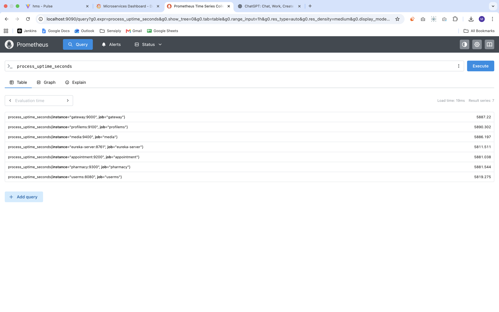
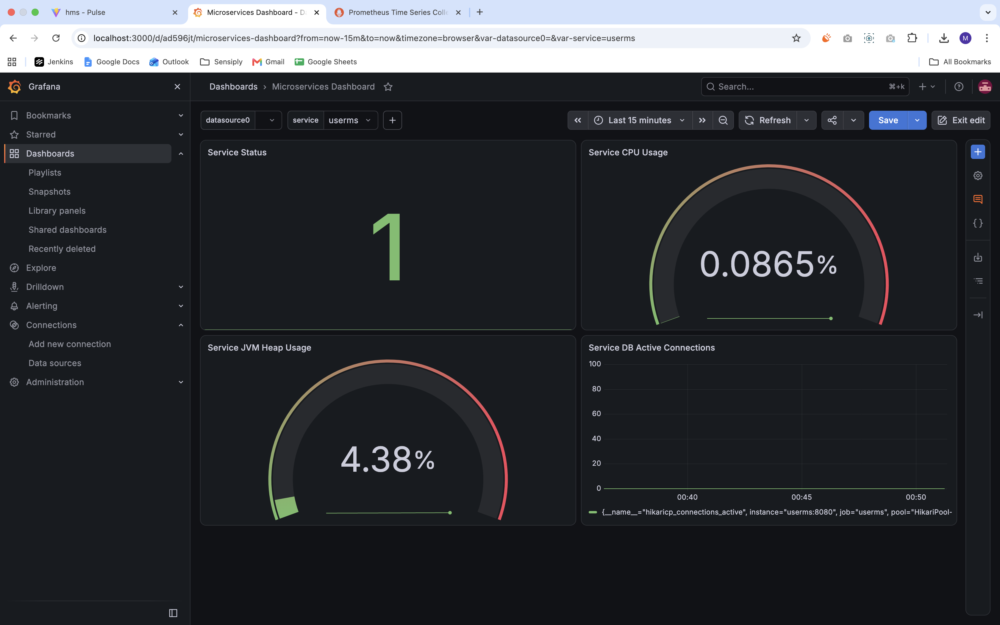
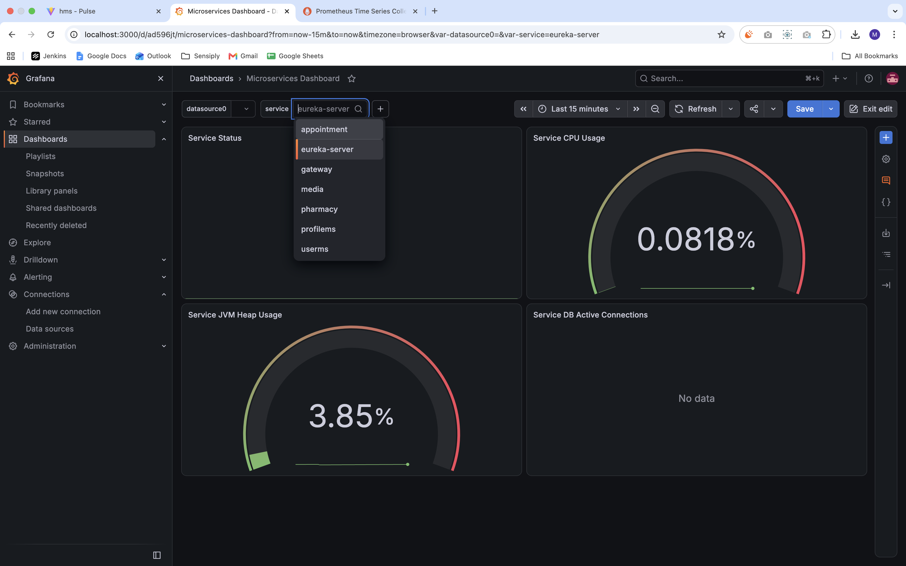

This repo is for demo deployment of Hospital Management System Application 
on local docker containers with docker-compose along with 
implementing Application Monitoring using Prometheus & Garfana 

Hospital Management System Application was cloned from: 
> https://github.com/Tarunbhargava/Hospital-Management-System.git 

The Application is built on Java Spring Boot microservices for Backend 
along with Eureka registry service, and Gateway service for API routing. 
The Services use Maven for building & packaging the dependencies. 
Frontend is built on React (Vite+TypeScript). For Databases, MySQL Server 
is configured to use with separate databases for microservices. 

Prometheus & Grafana servics are deployed using docker-compose, with prometheus 
configuration file mounted into a service volume from the prometheus/ directory 
,and using persistent volume for Grafana. 

(my grafana dashboard json file is present at grafana/ directory for import) 

Prometheus Scraping: 

 

Grafana Dashboard: 

 

 